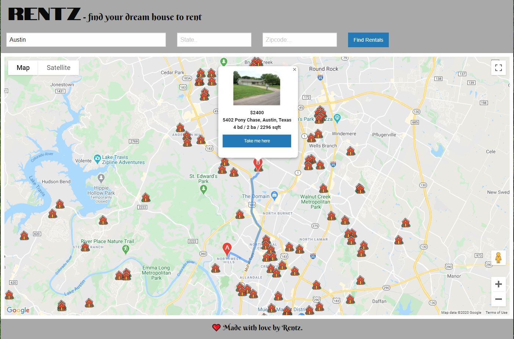

# Rentz - find real estate rentals

This site can help someone who is looking for a place to rent. It puts available rentals on the Google Map also 
allows a user to get directions to the rental right on the same map (this is the feature that is not available on most of the Real Estate sites).

A user can search by city, state and/or zip code. Available rentals in this area get placed on the map. User can click on a rental to see a house picture and general info, and also to get directions from his/her current location. 

The very first time the site is opened, the map appears which is centered on the downtown Austin. Aftre a search is completed, the results are saved on local storage. Next time the site is opened, the last search results get populated from the local storage.

# Technologies used

* HTML
* JavaScript
* Server-Side APIs 
    * Realtor APIs 
    * Google Maps JavaScript APIs
    * Google Maps Geolocation APIs
    * Google Maps Directions APIs
* Local Storage
* Foundations CSS Framework
* CSS

# Deployed web site

The link to deployed site is https://pochobs.github.io/Project1/.

# GitHub repository

You can find the repository here: https://github.com/pochobs/project1.

# Page preview

This is the preview of the initial page:
